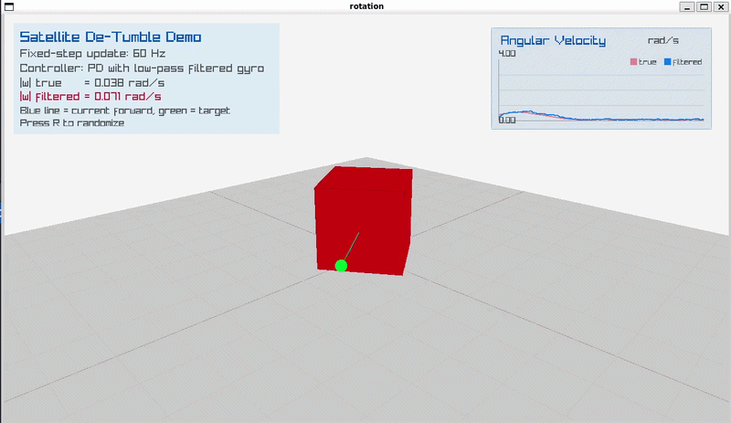

# Satellite De-Tumble Demo

3D visualization of a PD attitude controller driving a tumbling satellite to a fixed target. C++17 + [raylib](https://www.raylib.com/).

Implements:
- Low-pass filtering of noisy angular velocity measurements
- Quaternion-based attitude
- Asymmetric inertia to simulate an asymmetric satellite

Press `R` to randomize.



## Control loop (60hz)

1. Get attitude error
2. Add noise to angular rate, then low-pass filter
3. PD torque: scale error by Kp, subtract filtered rate × Kd
4. Get angular acceleration: `dw/dt = I^-1 * (T - w x (I*w))`
5. Add angular acceleration to angular velocity
6. Rotate quaternion by angular velocity delta, renormalize

## Code structure

- `src/main.cpp` - Render loop, no math
- `src/simulation.cpp` - dynamics
- `src/ui.cpp` - HUD
- `include/satellite-detumble/simulation.hpp` - dynamics API
- `include/satellite-detumble/ui.hpp` - rendering API

## Build

```bash
# Linux
cmake -S . -B build && cmake --build build  # (also fetches raylib)
./build/satellite-detumble
```
